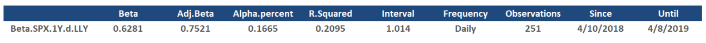

# iBeta.R

This is an online regression beta calculator for use in risk analysis and valuation. Along with the graph of the beta calculation,
we've also included a numeric output, summarizing its attributes in a data frame.



-----------------------------------------------------------------------------------------------------------------
To use this function, we can either use the common quantmod download,

```
getSymbols('^GSPC')
```

and

```
getSymbols('LLY')
```

to collect price data on the S&P 500 (designated "^GSPC" by Yahoo Finance), and our given stock, LLY,

then apply the function to these data, as below,

```
Beta(LLY, GSPC, Interval = 1, Frequency = 'Daily', Theme = 'GV')
```

to determine the 1-year, daily beta with respect to the S&P 500,

or alternatively, using the Tidyquant function call, "tq_get", built into the function, we can download the data
within the function itself, saving on space within the global environment, as follows,

```
Beta('LLY', '^GSPC', Interval = 1, Frequency = 'Daily', Theme = 'GV')
```

where we can run, ('Daily'), ('Weekly') or ('Monthly') returns calculations with it as well.

-----------------------------------------------------------------------------------------------------------------

What is a beta? The beta coefficient is the slope of the line determined by linear regression of returns series,
returns on a given y-valued instrument versus returns on a given x-valued one.

The idea of beta is that it is a representation of the price sensitivity of the y-valued instrument with respect to a chosen x.

Price sensitivity might also be termed "relative risk," but the idea is to be able to determine a multiplier descriptive of the
typical alignment and magnitude of price change of one instrument with respect to another.

For example, if you calculate the beta of some given stock with respect to the S&P 500, and you determine that it has a beta of
1.35, the idea conveyed by this number is that this stock is 35% more risky that the S&P (which might be thought of as a shorthand
representation of the equities market as a whole), and that this stock is positively correlated with the S&P.

There can also be negative betas. Some financial instruments move in inverse relation to others.

If the S&P goes up by 10%, you might expect your stock to go up by (1.35)*(10%), or 13.5%.

However, this is a statistical quantity, typically with a significant amount of standard error associated with it. 

We can't say that this stock moves in perfect lockstep with respect to the market, but that this is the typical relationship
it exhibits with respect to the market, over the chosen interval of time, and using the chosen period of returns calculation.

Within valuation, beta is used in Discounted Cash Flow analysis for determining the cost of equity capital by the CAPM.
The Capital Asset Pricing Model (CAPM) is the typical model by which to think about risk and return in the context of valuation.

Using the CAPM, the cost of equity might be calculated as,

Re = Rf + Beta*(Rm-Rf),

that is, the cost of equity is the risk free rate (typically the 10-Year US Treasury), plus beta times the equity risk premium,
the level of return associated with market-typical equities over and above the risk free rate.

Re then goes into the determination of the Weighted Average Cost of Capital used in DCF.
